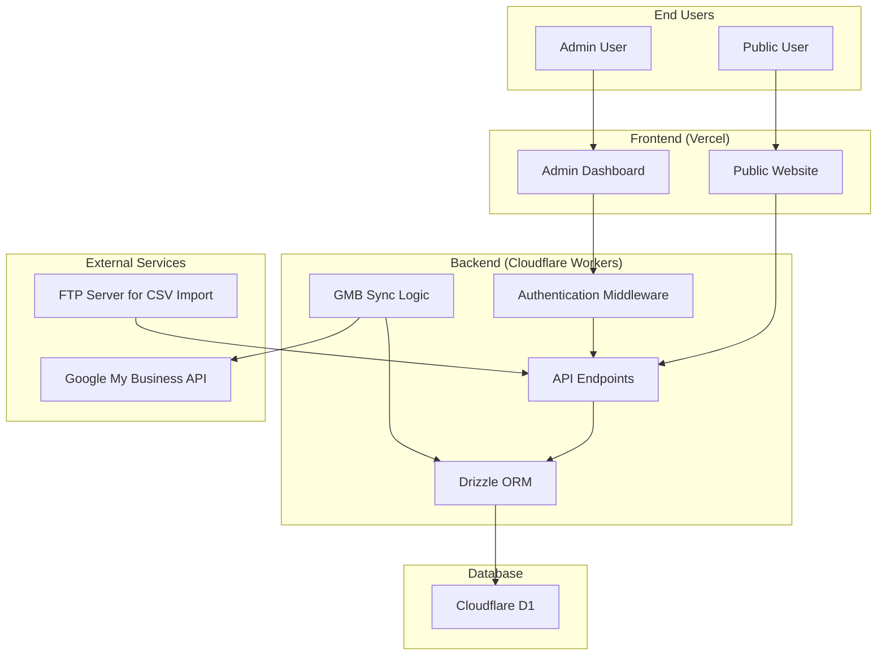

# System Patterns: Location Data Service

This document outlines the key architectural patterns and data flows for the Location Data Service.

## High-Level Architecture

The system is designed as a decoupled, three-tier architecture:

1.  **Frontend (Vercel):** A Next.js application serving two distinct user experiences: a public, read-only website and a secure admin dashboard.
2.  **Backend (Cloudflare Workers):** A serverless API layer that handles all business logic, data access, and authentication.
3.  **Database (Cloudflare D1):** The central data store for all location information.



## Key Design Patterns

### 1. Single Source of Truth (SSoT)

*   **Pattern:** The Cloudflare D1 database is the canonical source for all location data. All reads and writes must go through the backend API.
*   **Rationale:** Prevents data fragmentation and ensures consistency across all consuming applications (public site, admin dashboard, internal systems).

### 2. Decoupled Frontend and Backend

*   **Pattern:** The frontend is a pure client of the backend API. It has no direct access to the database.
*   **Rationale:** Allows for independent development, scaling, and deployment of the frontend and backend. It also enhances security by abstracting the data layer.

### 3. Serverless API

*   **Pattern:** The backend logic is deployed as serverless functions on Cloudflare Workers.
*   **Rationale:** Provides automatic scaling, reduces infrastructure management overhead, and is cost-effective as it only runs when requests are made.

### 4. Gated Access via Authentication

*   **Pattern:**
    *   The admin dashboard and its corresponding API endpoints are protected by Better Auth. Users must log in to access them.
    *   API access for internal systems is secured via tokens (JWT, API Keys).
    *   The public website consumes non-sensitive data from public-facing, read-only API endpoints.
*   **Rationale:** Enforces strict security and role-based access control, ensuring that data can only be viewed or modified by authorized users and systems.

### 5. Multi-Channel Data Ingestion

*   **Pattern:** The system supports multiple methods for updating data:
    1.  **Manual:** CRUD operations via the admin dashboard.
    2.  **Automated (Push):** An endpoint to handle CSV file uploads from a secure FTP server.
    3.  **Automated (Sync):** A scheduled or manually triggered process to synchronize data with Google My Business.
*   **Rationale:** Provides flexibility for different operational needs, from ad-hoc manual corrections to bulk automated updates.

## Implemented Authentication Patterns ✅

### Better Auth Integration Pattern
*   **Implementation:** Better Auth with Drizzle ORM adapter for SQLite/D1 compatibility
*   **Configuration:** Admin-only user creation, 7-day sessions, trusted origins for CORS
*   **Security:** Secure password hashing, session-based authentication, automatic redirects

### Frontend Authentication Flow
```
User Request → Session Check → Redirect to Login (if needed) → Authentication → Dashboard Access
```

### Backend Authentication Middleware
*   **Hono Framework:** Clean routing with authentication middleware
*   **Route Protection:** `/api/*` routes require authentication, `/public/*` routes are open
*   **CORS Configuration:** Proper cross-origin setup for frontend/backend communication

### Database Schema Pattern
*   **Better Auth Tables:** `user`, `session`, `account`, `verification` (SQLite-compatible)
*   **Location Tables:** `locations`, `districts`, `managers`, `store_hours` with proper relations
*   **Migration Strategy:** Drizzle ORM push-based migrations for D1 database
